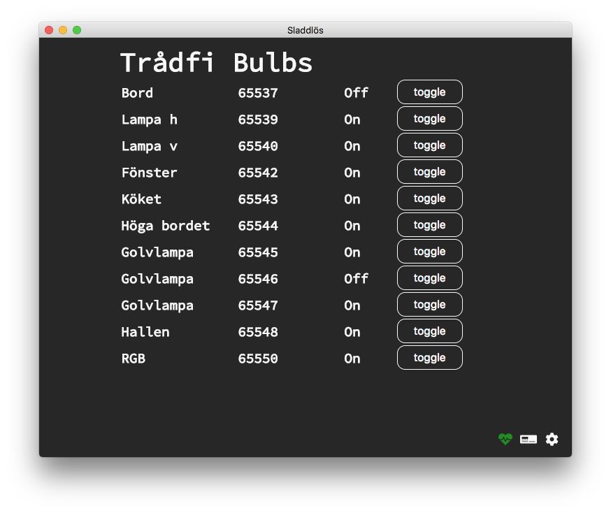

# Sladdlös

A control panel for Ikea Trådfri lightbulbs.



## Prerequisites

1) One or more Ikea Trådfri lightbulb

2) A Ikea Trådfri Gateway

3) A [Caesium](https://github.com/frklan/caesium) API end point

## Installation

``` bash
# clone the git repository
git clone git@github.com:frklan/sladdlos

# install dependencies 
$ npm install

# start app in development mode with hot reload
$ npm run dev

# build a executable
$ npm run build
```

At first start you must supply a url to the Caesium API endpoint and a valid JWT authorization token, see [see caesium README how to generate a token](https://github.com/frklan/caesium)

# Contributing

Contributions are always welcome!

When contributing to this repository, please first discuss the change you wish to make via the issue tracker, email, or any other method with the owner of this repository before making a change.

Please note that we have a code of conduct, you are required to follow it in all your interactions with the project.

# Versioning

We use [SemVer](http://semver.org/) for versioning. For the versions available, see the [tags on this repository](https://github.com/frklan/sladdlos/tags).

# Authors

* **Fredrik Andersson** - *Initial work* - [frklan](https://github.com/frklan)

# License

This project is licensed under the MIT License - see the [LICENSE](LICENSE) file for details

---

This project was generated with [electron-vue](https://github.com/SimulatedGREG/electron-vue) using [vue-cli](https://github.com/vuejs/vue-cli).
